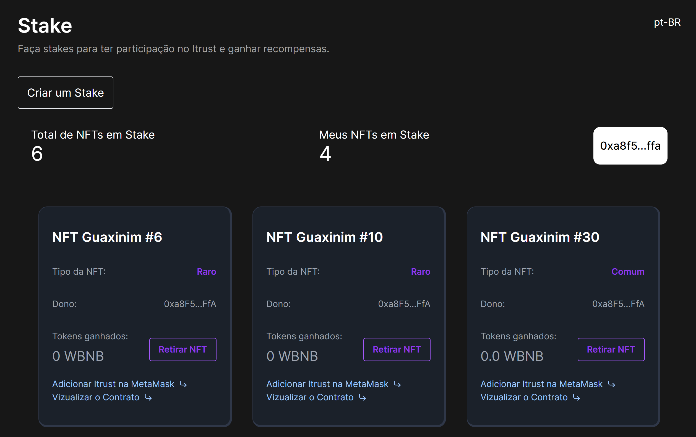
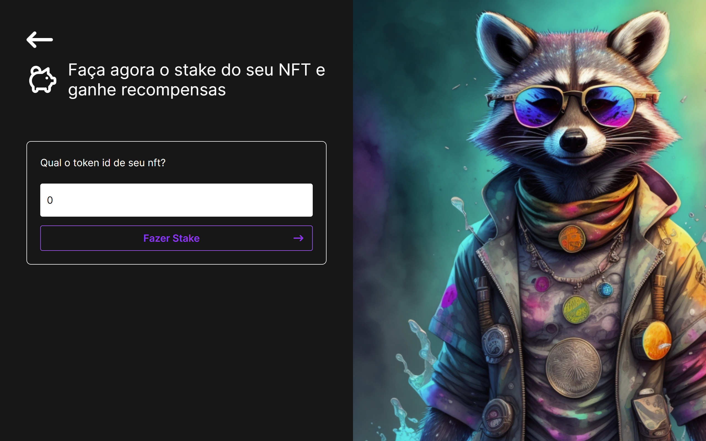

# ITRUST - Stake NFT Protocol

Welcome to ITRUST, an innovative NFT staking protocol that introduces a novel approach to incentivize and reward stakeholders using the earnings generated from our cutting-edge video platform. This protocol seamlessly integrates non-fungible tokens (NFTs) with staking mechanisms, creating a unique ecosystem that benefits both content creators and token holders.

## Vercel Deploy

Link: https://stake-nft-plum.vercel.app/

## Softwares

- [Next.js](https://nextjs.org/)
- [Solidity](https://soliditylang.org/)
- [Hardhat.js](https://hardhat.org/)
- [TypeScript](https://www.typescriptlang.org/)

## Contracts

Deployed in Binance Smart Chain network.

- ITrustStake.sol StakeNFT

  Address:
  https://sepolia.etherscan.io/address/

- ITrustCollection.sol Collection NFT

  Address:
  https://sepolia.etherscan.io/address/

## Author

- Allex Antoniollo

## Screenshots

